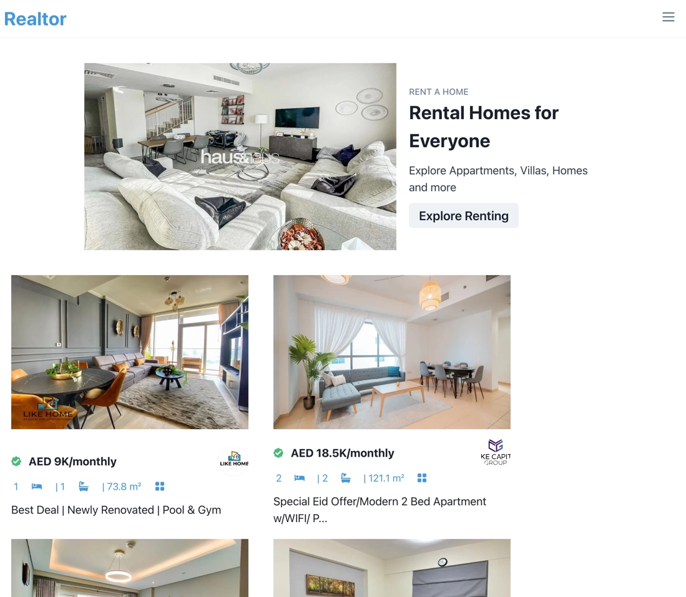

# Realtor App

Another JAM front end application. It provides a simple and convenient interface to a wide array of real eastate properties that are put up for rent or sale in the UAE region. The user has the option to sift through the database for any kind of residence in any size and price range. By applying a multitude of search filters such as number of rooms and baths, type of property etc. users can further drill down for more insight and find their dwelling place they have always been dreaming of.

The technical underpinnings are next.js and chakra ui. The app consumes all its data from a single API source with a few endpoints.

[Realtor demo site](https://therealtorapp.netlify.app/)
